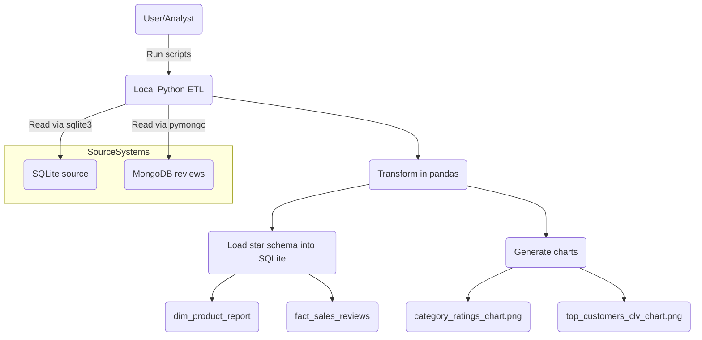

# GadgetGrove Miniature Customer Analytics Pipeline

## Comprehensive Project Report

### 1. Executive Summary

This project implements a robust ETL (Extract, Transform, Load) pipeline for GadgetGrove, integrating multiple data sources to provide actionable insights into customer behavior, sales, and product performance. By combining structural transactional data from a relational database and unstructured feedback from a document-store database, the pipeline creates a unified analytical view organized in a star schema. This data warehouse allows data analysts and decision makers to measure metrics such as the Customer Lifetime Value (CLV) and average satisfaction scores per item category.

### Project Structure

- `src/generate_data.py` — generates synthetic sample data in SQLite and MongoDB, and optionally exports JSON.
- `src/etl_pipeline.py` — runs full ETL: extraction from SQLite and MongoDB, transformation in Pandas, and load into analytics tables.
- `data/reviews_export.json` — exported review documents sample from MongoDB.
- `Database/` — (optional) contains local database files or SQL scripts for initial setup.
- `sql/setup_sql.sql` — SQL schema and sample DDL for source relational tables.
- `visualizations/` — output charts and analytics plots generated by the pipeline.
- `requirements.txt` — Python dependencies.
- `README.md` — project usage and run instructions.
- `Project_Report.md` — this final project report.

### Technology Stack

- Python 3.x (core implementation)
- SQLite (`sqlite3`) for source transactional data and final star schema warehouse tables
- MongoDB (`pymongo`) for review document store and semi-structured feedback data
- Pandas for data extraction, cleaning, merging, and transformation operations
- Matplotlib for generating visual analytics charts
- JSON for sample export of review documents

### 2. Architecture and Data Strategy

The project relies on a hybrid data infrastructure to simulate a real-world enterprise environment:

- **Relational Data Store (SQLite):** Used for transactional data such as Customers, Products, and Orders, due to its well-defined structured relationships and strict ACID compliance.
- **NoSQL Data Store (MongoDB):** Used for Customer Reviews, suitable for document-based, semi-structured data which scales well for high-volume text sentiment and ratings.
- **Data Warehouse (SQLite via Python Pandas):** Used as the final reporting layer organized in a Star Schema format, enabling fast read aggregations.

### 2.1 Architecture Diagram

### 3. Source Data Models

**SQLite Source Schema:**

- `Customers` (customer_id, customer_name, registration_date)
- `Products` (product_id, product_name, category, price)
- `Orders` (order_id, customer_id, product_id, order_date, quantity)

**MongoDB Source Collection:**

- `Greenfield.reviews` (review_id, product_id, customer_id, rating, review_text)

### 4. ETL Pipeline Process (`src/etl_pipeline.py`)

#### 4.1. Extraction

- **Relational Data:** Python connects to `shop.db` and uses an SQL `JOIN` command to merge the Orders, Customers, and Products tables into a highly-denormalized Pandas DataFrame.
- **Document Data:** Python extracts the entire `reviews` collection from MongoDB using `pymongo`.

#### 4.2. Transformation

The pipeline leverages the `pandas` library to clean and enrich the data:

- Both datasets are merged using a Left Join based on `customer_id` and `product_id`.
- **Handling Nulls:** Any orders missing a corresponding review are assigned a default rating of `0`.
- **Derived Metrics:**
  - `is_satisfied`: A boolean flag generated based on whether the rating is $\geq 4$.
  - `total_price`: Calculated across individual orders (`quantity` \* `price`).
- **Complex Aggregations (Customer Lifetime Value - CLV):** Groups data by `customer_id` to calculate the total lifetime spend for every user, which is then mapped back dynamically to the main dataset to provide contextual value for every record.

#### 4.3. Loading (Star Schema)

Data is loaded back into the SQLite Engine optimized for OLAP analytics.

- **Dimension Table (`dim_product_report`):** Stores discrete product information (`product_key`, `product_name`, `category`).
- **Fact Table (`fact_sales_reviews`):** Contains granular transactional events linked with customer reviews, product keys, generated surrogate sale keys, derived total price, ratings, satisfaction flags, and customer lifetime value.

### 5. Outputs and Visualizations

The processed metrics are visualized using `matplotlib` to surface data insights visually:

1. **Average Product Rating by Category (`category_ratings_chart.png`):** Shows how well different product categories (e.g., Electronics, Accessories, Furniture, Appliances) perform based on user reviews.
2. **Top 5 Customers by Lifetime Value (`top_customers_clv_chart.png`):** Pinpoints the most valuable users by aggregating all of their orders, useful for targeted marketing.

### 6. Code Dependencies

- `pandas`: Data manipulation and transformations.
- `pymongo`: Extractor for the NoSQL MongoDB instance.
- `matplotlib`: Chart creation and saving.
- `sqlite3`: Native SQLite integration module.

### 7. How to run

1. Install requirements: `pip install -r requirements.txt`.
2. Generate Data Sources: `python src/generate_data.py`. (Outputs `.db`, writes to MongoDB, and generates `reviews_export.json`).
3. Run Pipeline: `python src/etl_pipeline.py`. (Extracts schemas, creates DW schema, and exports visualizations to `/visualizations`).
